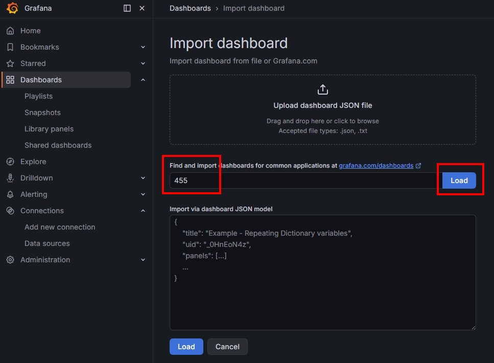
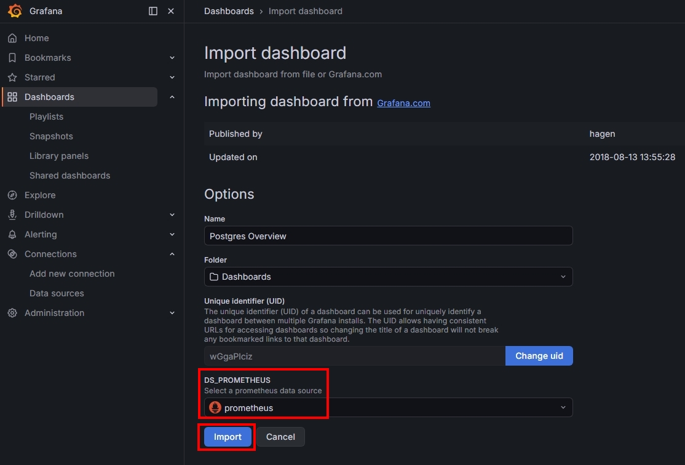
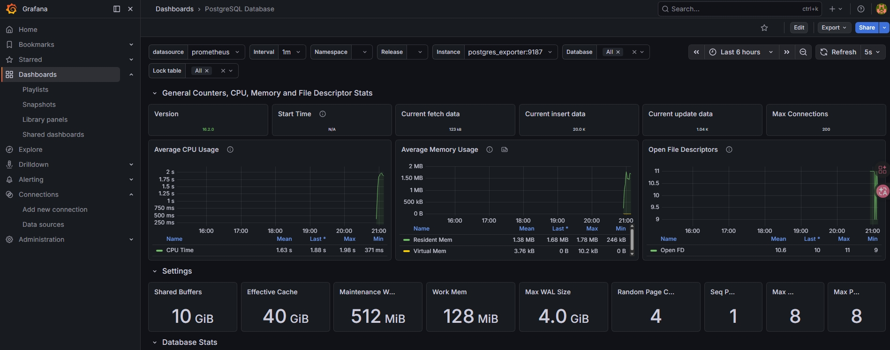
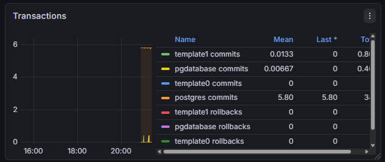
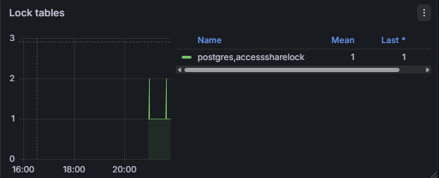
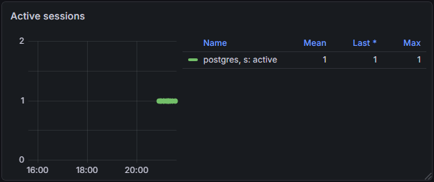
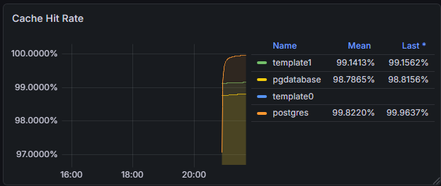
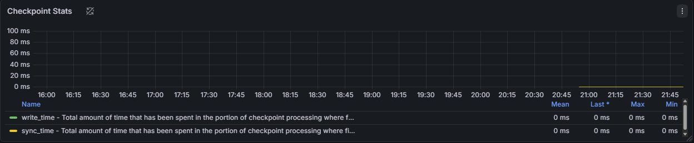

## *DEV Startup Service*

### *1.　PostgreSQL*
- #### *a.　背景啟動*
  ```
  docker-compose build --no-cache
  docker-compose up -d
  ```
- #### *b.　確認相關設定*
  ```
  -- 確認擴充功能版本
  SELECT name, installed_version 
  FROM pg_available_extensions 
  WHERE installed_version IS NOT NULL;
  
  -- 確認 ??? 是否啟動
  SHOW pg_stat_statements.track;
  SHOW shared_buffers;
  SHOW work_mem;
  SHOW synchronous_commit; -- 用 python client 控制設定 off

  -- 確認 Monitoring 角色 ( has_pg_monitor => true, has_read_stats => true )
  SELECT
      r.rolname,
      m.rolname as member_of,
      r.rolcanlogin AS can_login,
      CASE WHEN r.rolsuper THEN 'YES' ELSE 'NO' END AS is_superuser,
      -- 檢查是否擁有 pg_monitor 權限
      pg_has_role(r.rolname, 'pg_monitor', 'USAGE') AS has_pg_monitor,
      -- 檢查是否擁有 pg_read_all_stats 權限
      pg_has_role(r.rolname, 'pg_read_all_stats', 'USAGE') AS has_read_stats,
      r.rolconnlimit AS conn_limit
  FROM pg_roles r
  LEFT JOIN pg_auth_members am ON r.oid = am.member
  LEFT JOIN pg_roles m ON am.roleid = m.oid
  WHERE r.rolname = 'postgres_exporter';
  
  -- 試著下面語句，確認現在資料庫在「等什麼」
  SELECT * FROM pg_wait_sampling_current;
  ```

<br>

### *~~2.　Setting Account to Airflow in PostgreSQL~~*
- #### *a.　進入 PostgreSQL container*
  ```
  # -U : 使用已存在的使用者
  # -d : 連到對應資料庫
  
  docker exec -it pg-cluster-dev-db-1 psql -U pguser -d pgdatabase
  ```
- #### *b.　創建資料庫*
  ```
  CREATE DATABASE airflow;
  ```
- #### *c.　創建使用者*
  ```
  CREATE USER airflow WITH PASSWORD 'airflow';
  ```
- #### *d.　給使用者權限*
  ```
  GRANT ALL PRIVILEGES ON DATABASE airflow TO airflow;
  ```
- #### *e.　驗證*
  ```
  # 確認是否連上資料庫
  docker exec -it pg-cluster-dev-db-1 psql -U airflow -d airflow
  ```

<br>

### *3.　Airflow*
- #### *a.　創建目錄 + 給予指定資料夾權限 + 初始化*
  ```
  mkdir config; mkdir dags; mkdir logs; mkdir plugins;
  sudo chown -R 50000:0 ./airflow
  
  docker-compose up airflow-init
  ```
- #### *b.　背景啟動*
  ```
  docker-compose up -d
  ```
- #### *c.　懶人開發 ( WIN to WSL2 )*
  ```
  # ⭐ 懶人腳本
  ./deploy_dags.sh
  
  # 1.　先一次性校正為目前使用者的權限，確保能夠從 Windows 路徑複製檔案
  sudo chown -R $USER:$USER ~/OLTP-OLAP-Unified-DB/docker/airflow/dags
  
  # 2.　從 Windows 路徑複製 DAGs 到 Airflow 容器的對應資料夾
  cp -ra /mnt/c/Users/PC/Code/Python/Publish-To-Git/OLTP-OLAP-Unified-DB/dags ~/OLTP-OLAP-Unified-DB/docker/airflow/dags
  
  # 3. 校正為 Airflow 容器需要的權限
  sudo chown -R 50000:0 ~/OLTP-OLAP-Unified-DB/docker/airflow/dags
  sudo chmod -R 775 ~/OLTP-OLAP-Unified-DB/docker/airflow/dags
  ```
- #### *d.　移除服務*
  ```
  # 停止且移除 :「容器」、「沒定義的孤兒」、「資料庫內容」
  docker-compose down --volumes --remove-orphans
  
  # 清理所有「已停止」的容器
  docker container prune -f
  
  # 清理所有「未被掛載」的 Volume
  docker volume prune -f
  ```
- #### *e.　除錯 DAG 方式*
  ```
  # 進入容器
  
  # 執行除錯命令
    [1] airflow dags reserialize
    [2] python3 /opt/airflow/dags/WF_AUTO_PARTITION.py
    [3] airflow dags test WF_AUTO_PARTITION 2026-04-07
  
  # 強制刷新與檢查 Import Errors
    airflow dags list-import-errors
  
  # 強制刷新 DAG
  docker exec -it pg-cluster-airflow-scheduler-1 airflow dags reserialize
  ```

- #### *f.　查水錶找到主閘道*
  ```
  [法1]
  docker inspect -f '{{range .NetworkSettings.Networks}}{{.IPAddress}}{{end}}' airflow-airflow-worker-1
  # 172.19.0.7: 為 Airflow 容器，在 Docker 虛擬網路裡的私有 IP
  # 172.19.0.1: 就是它的出口； 繞過連線實體位置的坑 ( 在 YAML 加上 'host.docker.internal:172.19.0.1' )
  
  [法2]
  docker network ls # 找到欲查詢容器網路
  docker network inspect <容器網路名稱> -f '{{range .IPAM.Config}}{{.Gateway}}{{end}}'
  直接找到出口
  ```

<br>

### *~~4.　PoWA~~*
- #### *a.　背景啟動*
  ```
  docker-compose up -d --build powa-postgres powa-web
  ```

- #### *b.　確認擁有角色權限 + Schema 是否建立*
  ```
  # 進入容器
  docker exec -it powa-postgres psql -U powa -d powa
  
  # 確認角色權限
  \du
  
  # 確認 schema
  \dn
  ```

- #### *c.　檢查 Extensions*
  ```
  # 確認 \dx # 應該要有 (5 rows) : [pg_stat_statements, btree_gist, hypopg, plpgsql, powa]
  \dx
  
  # 若無，手動執行
  docker exec -it powa-postgres psql -U powa -d powa -f /docker-entrypoint-initdb.d/01_powa.sql
  ```

- #### *d.　確保已經建立 Server*
  ```
  SELECT * FROM powa_servers;
  ```

- #### *e.　測試 Web 使用者能登入 sql*
  ```
  docker exec -it powa-postgres psql -U powa -d powa
  ```

- #### *f.　Web UI 登入資訊*
  ```
  username : powa
  password : powa
  server   : powa-db
  ```
  
<br>

### *5.　IOT Platform*
- #### *a.　啟動*
  ```
  # 設定 MQTT 密碼 # 建立一個 admin 的帳號，並基於密碼生成 Hash
  touch ./config/passwd
  sudo chown root:root ./config/passwd
  docker exec -it pg-cluster-mqtt-1 mosquitto_passwd -b /mosquitto/config/passwd admin 123456789
  
  # 1. 建立共享網路
  docker network create pg-cluster_iot_network
  
  # 2. 啟動 MQTT
  docker-compose -f mqtt-compose.yaml up -d
  
  # 3. 啟動 Kafka
  docker-compose -f kafka-compose.yaml up -d
  ```

- #### *b.　[ MQTT ] 測試 Broker 是否認得帳密*
  ```
  # 故意不用密碼 => 失敗
  docker exec -it pg-cluster-mqtt-1  mosquitto_sub -t "test/topic"
  
  # 使用帳號密碼 => 成功，進入等待訊息狀態
  docker exec -it pg-cluster-mqtt-1  mosquitto_sub -t "test/topic" -u admin -P 123456789
  ```
  
- #### *c.　[ Kafka ] 設定 Kafka-Connect*
  ```
  # 1. 確認 kafka-connect 是否支援 MQTT Source Connector
  curl http://127.0.0.1:8083/connector-plugins | jq '.[].class'
  -- "io.confluent.connect.mqtt.MqttSinkConnector"
  -- "io.confluent.connect.mqtt.MqttSourceConnector"
  
  # 2. 傳送配置讓 Kafka 訂閱 MQTT Broker 指定主題，並將資料寫入 Kafka
  curl -X POST -H "Content-Type: application/json" --data @docker-compose/docker/iot-platform/config/connectors/mqtt-cp-mach-order.json http://127.0.0.1:8083/connectors
  
  # 3. 確認目前已訂閱清單
  curl http://127.0.0.1:8083/connectors
  
  # 4.1 確認 mqtt-cp-mach-order 配置
  curl http://127.0.0.1:8083/connectors/mqtt-cp-mach-order
  
  # 4.2 確認 mqtt-cp-mach-order 狀態
  curl http://127.0.0.1:8083/connectors/mqtt-cp-mach-order/status

  -------
  
  # 5. 暫停 Connector（不刪除，只是停止抓取資料）
  curl -X PUT http://127.0.0.1:8083/connectors/mqtt-cp-mach-order/pause
  
  # 6. 恢復執行
  curl -X PUT http://127.0.0.1:8083/connectors/mqtt-cp-mach-order/resume
  
  # 7. 重啟（當 Connector 出現 FAILED 狀態時試試看）
  curl -X POST http://127.0.0.1:8083/connectors/mqtt-cp-mach-order/restart
  
  # 8. 刪除 Connector
  curl -X DELETE http://127.0.0.1:8083/connectors/mqtt-cp-mach-order
  ```

<br>

### *6.　ELK*
- #### *a.　settings*
  ```
  # vm.max_map_count => Linux 核心（Kernel）的參數，用來限制一個進程可以擁有的虛擬記憶體區域（VMA）的最大數量
  # 預設值通常是 65530，但對於像 Elasticsearch 這樣需要大量記憶體映射的應用來說，可能會不夠用，導致啟動失敗或性能問題
  
  # [暫時性]
  sudo sysctl -w vm.max_map_count=262144
  
  # [永久性]
  sudo nano /etc/sysctl.conf
  
    # 在檔案末尾添加以下行
    vm.max_map_count=262144
  
    # 儲存退出後，執行以下指令讓它立刻生效
    sudo sysctl -p
    
    # 確認設定已生效
    cat /proc/sys/vm/max_map_count
  ```

- #### *b.　生成 token 給 kibana 使用*
  ```
  docker exec -it pg-cluster-elasticsearch-1 bin/elasticsearch-service-tokens create elastic/kibana kibana-token
  
  # 塞到 .env
  ```

- #### *c.　背景啟動*
  ```
  docker-compose up -d
  ```
  
- #### *d.　使用細節*
  ```
  # 查看 Logstash 的熱重啟狀態
  http://127.0.0.1:9600/_node/stats/pipelines?pretty
    # 找關鍵字 "last_success_timestamp" 確認重啟時間
  
  # 查看 Elasticsearch 的 Cluster Health 狀態
  http://127.0.0.1:9200/_cat/indices?v
  
  # 查看 Logstash 的實時日誌輸出，確認是否有錯誤或警告訊息
  # 因為有設置: stdout { codec => rubydebug }
  docker logs -f pg-cluster-logstash-1
  ```
  
<br>

### *7.　Gitlab*
```
# 管理員 初始帳密
  # [ACC]
  >> root
  
  # [PWD] docker exec pg-cluster-gitlab-1 cat /etc/gitlab/initial_root_password
  >> eZxoOr7lTxSzI1SDLYiowVi70QsfIPitLYx3TM7Kl8c=


# Secrets
  docker exec pg-cluster-gitlab-1 cat /etc/gitlab/gitlab-secrets.json


# 測試
  [USER 1]
  pc_wu
  8Nr~y\n8QQ:!&SU'
  
  [USER 2]
  jun_wu
  r2p8(G&(nJETwM]N


# Runner 工具檢查
  # 啟用 gitlab-runner 的開機自啟服務
  sudo systemctl enable gitlab-runner
  
  # 手動立即啟動
  sudo systemctl start gitlab-runner
  
  # 檢查目前服務狀態是否為 active
  sudo systemctl status gitlab-runner


# Runner 註冊維護
  # 查詢已註冊清單
  sudo gitlab-runner list
  
  # 註冊 Runner
  sudo gitlab-runner register
    # 1. 輸入 GitLab 伺服器 URL: http://127.0.0.1:8090/ (根據你的 GitLab 伺服器地址進行修改)
    # 2. 輸入註冊 Token (在 GitLab 專案的 Settings > CI/CD > Runners settings 中找到)
    # 3. 輸入描述: wsl2-local-runner
    # 4. 輸入標籤: docker,wsl2
    # 5. maintenance note: docker
    # 6. 執行器類型: docker
    # 7. Docker 映像: docker:24.0.5
    
    # Repo CI Settings
    [O] Indicates whether this runner can pick jobs without tags
  
  # 刪除 Runner
    # 指定網址與 Token 刪除
    sudo gitlab-runner unregister --url http://YOUR_GITLAB_URL --token YOUR_RUNNER_TOKEN
    
    # 指定名稱刪除
    sudo gitlab-runner unregister --name "wsl2-local-runner"
    
    # 一鍵清空所有本地 Runner
    sudo gitlab-runner unregister --all-runners
    
    # 設定檔全部都註冊在此檔中 清空即清除
    sudo cat /etc/gitlab-runner/config.toml
    sudo rm /etc/gitlab-runner/config.toml
    sudo touch /etc/gitlab-runner/config.toml
  
  # [除錯] 驗證指定 runner
  sudo gitlab-runner verify
  
  # 事物完成 => 生效
  sudo systemctl restart gitlab-runner
  
  
# [Window TCP 轉發防火牆到 WSL2]
  # 開啟防火牆設置內外 TCP
  
  # [powershell 管理員] 
  # 8090 腳本
    # 1. 自動取得目前 WSL2 的內部 IP
    $wsl_ip = (wsl ip addr show eth0 | Select-String -Pattern 'inet\s+(\d{1,3}\.\d{1,3}\.\d{1,3}\.\d{1,3})' | ForEach-Object { $_.Matches.Groups[1].Value })
    
    Write-Host "偵測到目前的 WSL2 IP 為: $wsl_ip"
    
    # 2. 刪除舊的 8090 轉發規則（避免衝突）
    netsh interface portproxy delete v4tov4 listenport=8090 listenaddress=192.168.0.15
    
    # 3. 建立新的轉發規則，把 Windows 的 8090 轉給 WSL2
    netsh interface portproxy add v4tov4 listenport=8090 listenaddress=192.168.0.15 connectport=8090 connectaddress=$wsl_ip
    
    # 4. 強制允許防火牆通過 8090 Port
    New-NetFirewallRule -DisplayName "GitLab WSL2 8090" -Direction Inbound -LocalPort 8090 -Protocol TCP -Action Allow
    
    Write-Host "設定完成！請再次嘗試連線 http://192.168.0.15:8090"
    
    # 測試連線
    Test-NetConnection -ComputerName 192.168.0.15 -Port 8090
    
  # 5100 腳本
    # 1. 自動取得目前 WSL2 的內部 IP
    $wsl_ip = (wsl ip addr show eth0 | Select-String -Pattern 'inet\s+(\d{1,3}\.\d{1,3}\.\d{1,3}\.\d{1,3})' | ForEach-Object { $_.Matches.Groups[1].Value })
    
    Write-Host "偵測到目前的 WSL2 IP 為: $wsl_ip"
    
    # 2. 刪除舊的 5100 轉發規則（避免衝突）
    netsh interface portproxy delete v4tov4 listenport=5100 listenaddress=192.168.0.15
    
    # 3. 建立新的轉發規則，把 Windows 的 5100 轉給 WSL2
    netsh interface portproxy add v4tov4 listenport=5100 listenaddress=192.168.0.15 connectport=5100 connectaddress=$wsl_ip
    
    # 4. 強制允許防火牆通過 5100 Port
    New-NetFirewallRule -DisplayName "GitLab WSL2 5100" -Direction Inbound -LocalPort 5100 -Protocol TCP -Action Allow
    
    Write-Host "設定完成！請再次嘗試連線 http://192.168.0.15:5100"
  
    # 測試連線
    Test-NetConnection -ComputerName 192.168.0.15 -Port 5100
  

# CI Build ( Docker-in-Docker )
  # 編輯 config.toml
  sudo nano /etc/gitlab-runner/config.toml
  
  # 參考設定 (gitlab-runner/config.toml)
  
  # 重啟
  sudo systemctl restart gitlab-runner
```

<br>

### *8.　Docker Registry*
```
# 推本地映像檔到庫

  # 指令本地映像檔(含標籤) => 映射到庫的設定
  docker tag pg-python-cp:v1 127.0.0.1:5100/pg-python-cp:v1
  
  # 推庫
  docker push 127.0.0.1:5100/pg-python-cp:v1
  
# 實用查詢
  # 已建立映像庫
  http://127.0.0.1:5100/v2/_catalog
  
  # 指定映像庫 對應版本清單
  http://127.0.0.1:5100/v2/pg-python-cp/tags/list
  http://127.0.0.1:5100/v2/pg-python-inst/tags/list
  http://127.0.0.1:5100/v2/airflow-dags/tags/list

# 工具: skopeo
  # 安裝
  sudo apt-get update
  sudo apt-get install -y skopeo
  
  # 查詢
  skopeo inspect --tls-verify=false docker://127.0.0.1:5100/pg-python-cp:v1
  
  # [過濾] 創建時間 + 硬體架構
  skopeo inspect --tls-verify=false docker://127.0.0.1:5100/pg-python-cp:v1 | jq '{Created, Architecture, RepoTags}'
  
  # [過濾] 比對 Digest => airflow-dags:latest vs. airflow-dags:cad1040a
  skopeo inspect --tls-verify=false docker://127.0.0.1:5100/airflow-dags:latest | jq '.Digest'
  skopeo inspect --tls-verify=false docker://127.0.0.1:5100/airflow-dags:cad1040a | jq '.Digest'
  
  # [過濾] 計算映像檔下載所需的總傳輸大小
  skopeo inspect --tls-verify=false docker://127.0.0.1:5100/pg-python-cp:v1 | jq '[.LayersData[].Size] | add / 1024 / 1024 | "Total Size: \(.) MB"'
```

<br>

### *9.　Monitoring*
- #### *a.　背景啟動*
  ```
  docker-compose up -d
  ```
  
- #### *b.　Grafana 設定*
  ```
  # Login Grafana Web UI
    - acc: admin
    - pwd: admin
  
  # 新增 Prometheus datasource: http:127.0.0.1:9090
  
  # 快速導入 Dashboard ( Dashboards => New => Import )
  - Import via grafana.com :
    - PostgreSQL: 9628 ( TPS, Transactions, Locks, Cache hit, Connections, Database size )
    - Node Exporter: 1860 ( CPU, RAM, Disk IO, Disk usage, Network, Load average )
    - PostgreSQL Table: 12485 ( Table size, Table growth, Index size, Sequential scans, Index scans )
    - Kafka 全方位監控 : 11600
    - K8s 叢集基礎監控 : 1860
    - K8s 叢集進階監控 : 15760
  
  # 觀測重點 ( ⭐htap_grafana.json )
  HTAP Monitoring
    System Layer ( Node Exporter )
    - CPU
    - RAM
    - Disk IO
    - Disk usage
  
    PostgreSQL Layer ( Postgres Exporter )
    - TPS
    - Connections
    - Locks
    - WAL rate
    - Cache hit ratio
    - Checkpoints
  
    Table Layer
    - Top 10 table size
    - Top 10 seq scan
    - Top 10 index scan
    - Table growth
  ```
- 
- 
- 

- #### *c.　壓測觀察重點*
  ```
  TPS           穩定上升
  WAL rate      線性上升
  Cache hit     > 95%
  Locks         低
  Checkpoint    平穩
  ```

- #### *d.　監控位置*
  - #### *⭐ 1.　TPS: 每秒 Commit + Rollback 數*
  - 
    ```
    -- Equivalent SQL ⬇️ 
    SELECT
    xact_commit,
    xact_rollback
    FROM pg_stat_database;
    ```
    ```
    壓測觀察重點： 
    預期 : 逐漸上升 => 穩定
    非預期 : TPS 上升 → 突然下降
      - WAL Flush => Disk IO Saturation
      - Lock Contention => Transaction Locks
      - CPU Saturation => Transaction waiting for CPU
      - Memory Saturation => Transaction waiting for Memory
      - Network Saturation => Transaction waiting for Network
      - Checkpoint => Checkpoint Frequency too High
    ```
  - #### *⭐ 2.　WAL Rate*
    ```
    -- Equivalent SQL ⬇️ 
    None
    ```
    ```
    壓測觀察重點： 
    預期 : None
    非預期 : 突然暴增 ( WAL 持續線性成長 )
     - Numerous INSERTs
     - Numerous UPDATEs
     - Checkpoint ( WAL Rate Spike )
    ```
  - #### *3.　IO Saturation*
    ```
    -- Equivalent SQL ⬇️ 
    None
    ```
    ```
    壓測觀察重點： IO Wait
    預期 : None
    非預期 : IO Full => TPS 突然下降
    ```
  - #### *⭐ 4.　Lock Contention*
  - 
    ```
    -- Equivalent SQL ⬇️ 
    SELECT *
    FROM pg_locks;
    ```
    ```
    壓測觀察重點： 
    預期 : None
    非預期 :
        - Update Contention => 多 Transaction 更新同 Row
        - Index Page Lock => 多 Transaction 更新同 Index Page
        - DDL Lock => Schema Change
        - OLAP Query => AccessShareLock
    ```
  - #### *5.　Connections*
  - 
    ```
    -- Equivalent SQL ⬇️ 
    SELECT count(*)
    FROM pg_stat_activity;
    ```
    ```
    壓測觀察重點： 
    預期 : Connections 穩定
    非預期 : Connections 持續上升
        - Connection Leak => Client Connections Not Being Released
        - Connection Storm => Sudden Surge in Connection Attempts
        - Pool Misconfiguration => Connection Pooling Exploded
    ```
  - #### *⭐ 6.　Cache Hit Ratio*
  - 
    ```
    -- Equivalent SQL ⬇️ 
    None
    ```
    ```
    壓測觀察重點： 
    預期 : > 0.95
    非預期 : < 0.90
      - shared_buffers 不夠 ??? 
      - dataset > RAM ???
    ```
  - #### *⭐ 7.　WAL Flush / Checkpoint*
  - 
    ```
    -- Equivalent SQL ⬇️ 
    None
    ```
    ```
    壓測觀察重點： 
    預期 : None
    非預期 :
      - checkpoints_req => WAL segment filled up => max_wal_size too small
    ```
    
  - #### *8.　...*
    ```
    http://127.0.0.1:9187/metrics
    ```

<br><br><br>