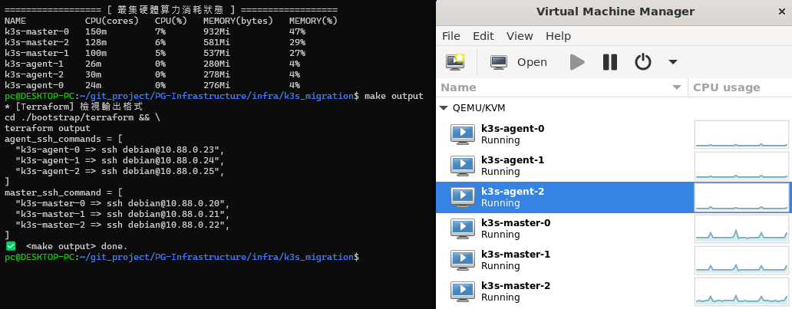
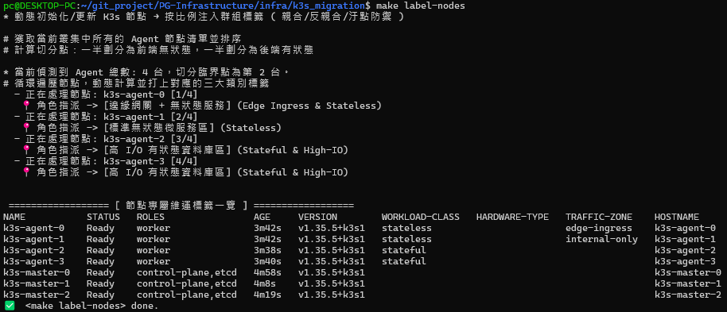
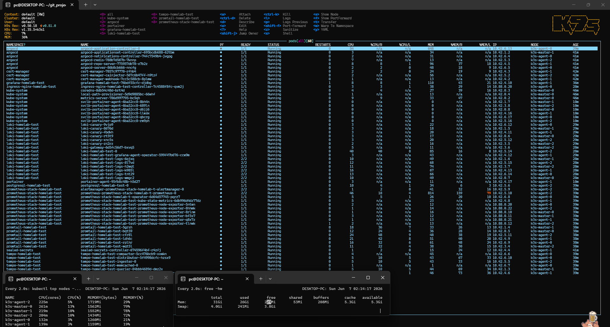

## *K3s Migration*

### *A.　部署框架演進*
```
Evolution: MiniKube -> K3d -> K3s -> ✅ K3s Migration -> Kubeadm -> GKE

Summary:
    # GitOps 架構 需極嚴謹考量 ( 包括: 服務依賴 / 環境切換 / 後期維運 / ... ) → 期間重構 3 次結構樹
        - Namespace
        - AppProject
        - Application
        - ApplicationSet
    # 遇到 OOM Kill 問題 → 折衷改為 Docker Compose + K3s 混合架構
    # Argo 同步機制坑 ( CRD / validatingwebhookconfigurations )
    # Helm Chart「諸侯割據」踩雷現象 → search: 渲染大法
    # 原生服務遷移坑 → 無法由 compose 先行體驗 而是直用 k8s 架起 → 注意力易發散
    # 各類狀況如何 DEBUG
        - configmap 設定檔
        - pod describe 病歷表
        - o yaml 查看實際部署設定
        - ...
    # 完整實施 k8s 框架下各類嘗試 ( E.　收斂階段 )
```

<br>

### *B.　VM 生命週期 ( Makefile )*

```
Terraform:
    # 初始化配置
    make init
    
    # 安裝 VM 環境 ( 包括: deploy_k3s.yml + init_nodes.yml ) → SSH 無密碼登入
    make apply VAR_FILE=./env_tfvars/homelab-test.tfvars
    
    # 拆除 VM 環境
    make destroy
    
Ansible:
    # 檢視狀態 ( pods + nodes )
    make status
    
    # VM 開機 ( K3s 集群 )
    make vm-power action=start
    
    # VM 關機 ( K3s 集群 )
    make vm-power action=stop
    
    # VM 重新啟動 ( K3s 集群 )
    make vm-power action=reboot
```

<br>

### *C.　遷移過程*

<details>
<summary><b><i>　c.1.　摸索 ( gitlab / postgresql ) </i></b></summary>
<ul>

```
* --- 持續觀察 --- *
kubectl get pods -n infra-data -w
kubectl get pods -n infra-monitor -w
kubectl get pods -n infra-tools -w
kubectl get pods -n dev-apps -w
```

```
* --- 新增官方 Helm 倉庫 --- *

# 新增 gitlab
helm repo add gitlab https://charts.gitlab.io/

# 新增 bitnami
helm repo add bitnami https://charts.bitnami.com/bitnami

# 新增 minio 官方倉庫
helm repo add minio https://charts.min.io/

# 結尾更新
helm repo update
```

```
* --- 建立命名空間 --- *

kubectl create namespace infra-data       # → Postgres, Kafka, Airflow
kubectl create namespace infra-monitor    # → Prometheus, Grafana, ELK
kubectl create namespace infra-tools      # → GitLab, Portainer, Vault
kubectl create namespace dev-apps         # → 自定義業務服務: cp, inst 
```

```
* --- 常見操作 --- *

# 檢視已建立密碼
kubectl get secrets -n infra-data
kubectl get secrets -n infra-tools

# 檢視密碼明文
kubectl get secret gitlab-postgres-pass -n infra-tools -o jsonpath="{.data.password}" | base64 --decode

# 檢視 ConfigMap
kubectl get ConfigMap -n infra-data

# 檢視 ingress
kubectl get ingress -n infra-tools

# 檢視 ingressroute
kubectl get ingressroute -n infra-tools

# ...
kubectl get ingressroutetcps.traefik.io -A

⭐ 檢視 svc -o yaml
kubectl get svc -n kube-system traefik -o yaml
kubectl get svc -n infra-tools gitlab-infra-webservice-default -o yaml

# 檢視已建立需對外網路服務
kubectl get svc -n infra-tools
kubectl get svc -n infra-data

# 虛擬化名稱檢視 log
kubectl logs -n infra-data -l app.kubernetes.io/name=postgresql

kubectl get pods -n infra-tools --show-labels
kubectl logs -n infra-tools -l app=gitaly
kubectl logs -n infra-tools -l app=minio
kubectl logs -n infra-tools -l app=sidekiq
kubectl logs -n infra-tools -l app=webservice
kubectl logs -n infra-tools -l app=migrations
kubectl logs -n infra-tools -l app=gitlab-exporter
kubectl logs -n infra-tools -l app=gitlab-shell

# 抓取崩潰日誌
kubectl logs -n infra-tools -l app=webservice -c dependencies

# 病歷表
kubectl describe pod -n infra-tools -l app=migrations
kubectl describe pod -n infra-tools -l app=webservice
kubectl describe pod -n infra-data -l app.kubernetes.io/name=postgresql
```

```
* --- 手動過渡期: 基礎設施基底 ( gitlab + postgresql + airflow ) --- *

# 1. 防呆
# 徹底刪除可能卡死的「內建」Postgres StatefulSet
kubectl delete statefulset gitlab-infra-postgresql -n infra-tools --ignore-not-found=true

# 刪除卡死的 gitlab-infra
kubectl delete jobs -n infra-tools -l release=gitlab-infra
 
# 2.1.1. 建立 K8s Secret: PostgreSQL # admin
kubectl create secret generic postgres-custom-auth \
--namespace infra-data \
--from-literal=postgres-password='SuperSecurePostgresPassword' \
--from-literal=password='SuperSecurePostgresPassword'
  
# 2.1.2. 建立 K8s Secret: PostgreSQL # gitlab
kubectl create secret generic gitlab-postgres-pass \
  --namespace infra-tools \
  --from-literal=password="SuperSecurePostgresPassword" \
  --dry-run=client -o yaml | kubectl apply -f -

# 2.2. 建立 K8s Secret: Redis
kubectl create secret generic gitlab-redis-pass \
  --namespace infra-tools \
  --from-literal=secret="GitLabRedisPassword123" \
  --dry-run=client -o yaml | kubectl apply -f -

# 2.3. 建立 K8s Secret:  MinIO 物件儲存憑證
kubectl create secret generic gitlab-minio-secret \
  --namespace infra-tools \
  --from-literal=accesskey="minioadmin" \
  --from-literal=secretkey="minioadminpassword" \
  --dry-run=client -o yaml | kubectl apply -f -

# 3.1 套用 ConfigMap + 啟動 postgresql
kubectl apply -f gitops/infra/environments/test/postgres-init-configmap.yaml
helm install postgres-infra bitnami/postgresql \
  --namespace infra-data \
  --create-namespace \
  -f gitops/infra/environments/test/postgres-values.yaml \
  --timeout 600s
  
# 3.2 確認是否吃進初始化檔案
kubectl exec -it -n infra-data sts/postgres-infra-postgresql -- ls -la /docker-entrypoint-initdb.d/
  
# 3.3 測試連線 ( pwd: SuperSecurePostgresPassword )
kubectl exec -it postgres-infra-postgresql-0 -n infra-data \
    -- psql -U gitlab -d gitlabhq_production

# 4.1.1 啟動 Gitlab ( 全家桶 | v10 開始需要自行建立全部拆光光 )
helm install gitlab-infra gitlab/gitlab \
  --namespace infra-tools \
  --create-namespace \
  -f gitops/infra/environments/test/gitlab-values.yaml \
  --version "^9.0.0" \
  --timeout 600s
  
# 4.1.2 更新自定義 ingress
kubectl delete ingress gitlab-infra-webservice-default -n infra-tools
kubectl delete ingressroutetcps.traefik.io gitlab-infra-gitlab-shell -n infra-tools
kubectl apply -f gitops/infra/base/ingress/gitlab-ingress.yaml
# kubectl apply -f traefik-rbac.yaml

# 4.2 覆蓋升級
helm upgrade gitlab-infra gitlab/gitlab \
  --namespace infra-tools \
  -f gitops/infra/environments/test/gitlab-values.yaml \
  --version "^9.0.0" \
  --force \
  --timeout 600s
  
# 4.3 確認能訪問 UI
    # 查看 Service 指向哪個 Port
    kubectl get svc -n infra-tools gitlab-infra-webservice-default -o jsonpath='{.spec.ports}'
    
    # 先確認能否訪問 再建立穩定 Ingress
    kubectl port-forward -n infra-tools svc/gitlab-infra-webservice-default 8090:8181
    
    # 查看 ingress 設置 ( K3s 是否有啟動 Traefik # 預設 )
    kubectl get pods -n kube-system | grep traefik
    
    # [管理員 powershell] 增加路徑 # 參考說明文件 docs/K3s.md
    
    # 查看 ingress 實際偵測到的路由 ( ADDRESS 有值 )
    kubectl get ingress -n infra-tools
    kubectl get ingressroute -n infra-tools
    
    # 訪問測試 1
    curl -v -H "Host: gitlab.k8s.local" http://10.88.0.20:30161

    # 訪問測試 2 確認走向
    tracert 10.88.0.20
    
    # 訪問測試 3
    http://gitlab.k8s.local:8080
    
    # 確認是否確實收到請求
    kubectl logs -n kube-system -l app.kubernetes.io/name=traefik -f

# [X] 5. 啟動 airflow
→ ⚠️ 遇到 OOMKilled → 折衷改為 Docker Compose
```

```
* --- 砍上述一系列依賴設置 --- *

# pods
helm uninstall gitlab-infra -n infra-tools
helm uninstall postgres-infra -n infra-data

# pvc
kubectl delete pvc -n infra-data --all

# ingress
kubectl delete ingress -n infra-tools --all

# ingressroute
kubectl delete ingressroute -n infra-tools --all

# helmchartconfig
kubectl delete helmchartconfig -n kube-system --all

# pv
kubectl delete pv -n infra-data --all
kubectl delete pv -n infra-tools --all

# secrets
kubectl delete secret -n infra-tools $(kubectl get secrets -n infra-tools -o jsonpath='{.items[*].metadata.name}' | tr ' ' '\n' | grep '^gitlab-infra-') --ignore-not-found
kubectl delete secret gitlab-postgres-pass -n infra-tools --ignore-not-found

# 刪除殘留的 ClusterRole/Binding (針對 Traefik)
kubectl delete clusterrolebinding traefik-kube-system --ignore-not-found
kubectl delete clusterrole traefik-kube-system --ignore-not-found
```

</ul>
</details>


<details open>
<summary><b><i>　c.2.　混合架構 ( 避免 OOM Kill ) </i></b></summary>
<ul>

<br>

<details open>
<summary><b><i>　I.　啟動服務 </i></b></summary>
<ul>


```
* 啟動 Docker Compose
cd infra/docker-compose
    make gitlab action=up
    make portainer action=up
    make mqtt action=up
    make kafka action=up
    make elk action=up


⭐ 啟動 K3s Cluster
    1. 初始化/更新 標籤設定 ( 親合/反親合 )
    make label-nodes
    
    2. 手動初始化 bootstrap
    make init-gitops
    
    3. 初始化/更新 Chart 依賴包
    make helm-chart-build
    
    4. 初始化/更新 ArgoCD 入口 ( root-app: appproject + appset )
    # 切換環境: 透過 appset/*/app.ymal 調整環境 (註解)
    make root-app ENV=homelab-test


* 其他
    # 節點資源配額預佔狀態 + 叢集硬體算力消耗狀態
    make k-top
    
    # 啟動 ingress-nginx → 已將其加入正式定義 無須用此方式
    make upgrade-ingress
    
    # 檢視 Secrets 明文 ( ex: homelab-test )
    make see-secrets ENV=homelab-test
    
    # 更新 VM Host 設定 => 可以拉取 registry images
    make update-vm-host

    # 更新 k9s 最愛設定
        - 備份原先設定
        cp /home/pc/.config/k9s/config.yaml /home/pc/.config/k9s/config.yaml.bak
        
        - 還原設定
        cp /home/pc/.config/k9s/config.yaml.bak /home/pc/.config/k9s/config.yaml
        
        ⭐ 一鍵替換設定
        make k9s-fav ENV=homelab-test
```

</ul>
</details>


<details>
<summary><b><i>　II.　結構樹說明 </i></b></summary>
<ul>

```
########################  NEW  ########################
* --- GitLab 專案結構樹 ( GitOps 與其對齊 ) --- *
    infra-live/
    ├── argocd/                         # 【 Control Plane / Bootstrap 層 】# 控制平面/開機層
    │   ├── root-app.yaml               # 【 Root Application / 大總管 】
    │   ├── projects/                   # 【 Tenants / Governance 邊界 】# 租戶隔離
    │   └── applications/               # 【 App Generators / 動態宣告器 】
    │       ...
    │       └── postgresql-appset.yaml  # 【 統一動態派發環境變數 】# test / stage / prod 
    │
    ├── charts/                         # 【 Bases / Helm Remote Wrappers 】# 基礎模板/封裝層
    │   ...
    │   └── databases/postgresql ( Chart.yaml / templates / values )
    │
    ├── templates/                      # 【 Internal Shared Manifests 】# 內部共享資產
    │   ├── app-deployment.yaml
    │   └── ingress-template.yaml
    │
    ├── policies/                       # 【 Cluster Guardrails 】# 叢集護欄/安全合規
    │   ├── deny-privileged-pods.yaml
    │   └── network-isolation.yaml
    │
    └── environments/                   # 【 Target Environments / Overlay 變數層 】# 環境覆蓋層
        ├── homelab-test/               
        │   └── ???-values.yaml         # 【 測試環境 】調校參數
        ├── homelab-stage/               
        │   └── ???-values.yaml         # 【 過渡環境 】調校參數
        └── homelab-prod/               
            └── ???-values.yaml         # 【 生產環境 】高可用參數
        


########################  OLD  ########################
* --- GitLab 專案結構樹 ( Repo 即是 infra-live 內容 ) --- *
    infra-live/
    ├── applications/
    ├── argocd/
    ├── bootstrap/
    ├── environments/
    ├── policies/
    ├── templates/
    └── README


* --- K3s 部署結構樹 ( GitOps 與其對齊 ) --- *
    infra-live/
    │
    ├── bootstrap/ # 叢集初始化必備元件
    │   └── cluster/
    │       ├── argocd/
    │       ├── namespaces/
    │       ├── cert-manager/
    │       ├── ingress-nginx/
    │       ├── sealed-secrets/
    │       └── scripts/
    │
    ├── environments/       ⚠️ Promotion Layer
    │   └── homelab/
    │       ├── test/
    │       ├── stage/
    │       └── prod/
    │
    ├── applications/       ⚠️ Deployable Units  
    │   ├── observability/
    │   │   ├── tracing/
    │   │   │   └── tempo/
    │   │   │
    │   │   ├── visualization/
    │   │   │   └── grafana/
    │   │   │
    │   │   ├── metrics/
    │   │   │   ├── exporters/
    │   │   │   │   ├── postgres-exporter/
    │   │   │   │   └── node-exporter/
    │   │   │   └── prometheus/
    │   │   │
    │   │   └── logging/
    │   │       ├── loki/
    │   │       └── promtail/
    │   │
    │   ├── platform/
    │   │   ├── registry/
    │   │   └── [X] argocd/     ⚠️ Deployment Controller
    │   │
    │   ├── security/
    │   │   └── vault/
    │   │
    │   ├── pg-apps/
    │   │   ├── cp/
    │   │   └── inst/ 
    │   │
    │   ├── databases/
    │   │   └── postgresql/
    │   │
    │   └── storage/
    │       ├── [X] longhorn/
    │       ├── [X] rook-ceph/
    │       ├── [X] minio/
    │       └── nfs/
    │
    ├── argocd/
    │   ├── projects/
    │   └── applications/
    │
    ├── policies/
    │
    ├── templates/
    │
    └── README
    
    infra-live/bootstrap/cluster
    └── namespaces/
        ├── monitoring.yaml
        ├── logging.yaml
        ├── security.yaml
        └── platform.yaml
    
    infra-live/environments/test/
    ├── root-app.yaml               ⚠️ App-of-Apps Pattern
    ├── core/core.yaml
    ├── observability/observability.yaml
    ├── security/security.yaml
    ├── storage/storage.yaml
    └── apps/apps.yaml
    
    infra-live/argocd               ⚠️ ArgoCD 治理邊界
    ├── applications/
    │   ├── grafana-app.yaml
    │   ├── prometheus-app.yaml
    │   └── ...
    │
    └── projects/
        ├── observability-project.yaml
        ├── platform-project.yaml
        ├── security-project.yaml
        ├── databases-project.yaml
        └── storage-project.yaml
    

* --- [?] Applications: Databases --- *

    infra-live/applications/databases/postgresql/
    ├── helm-release/
    ├── backup/
    ├── restore/
    ├── pvc/
    └── monitoring/
    
* --- Applications: Helm + Values 分離 --- *

    applications/observability/
    ├── Kustomize
    ├── ...
    └── visualization
     
    applications/observability/visualization/grafana/
    ├── charts/    # Helm Wrapper Chart ( Helm-first GitOps )
    ├── values/                     ⚠️ Environment Overlay
    ├── app.yaml   # ArgoCD Application 定義
    ├── Chart.lock # 初始化 Chart 依賴包後自動生成
    └── Chart.yaml # Helm Chart 定義 ( 包含依賴包定義 )

    applications/observability/visualization/grafana/values/    ⚠️ Promotion Flow ( 非 main / Git Tag Promotion )
    ├── common.yaml  # 共用: image repo / ingress annotations / persistence
    ├── test.yaml
    ├── stage.yaml
    └── prod.yaml
```

</ul>
</details>


<details>
<summary><b><i>　III.　實施階段 </i></b></summary>
<ul>

```
Layer 1 — Infra Provisioning ( Terraform )

Layer 2 — Node Bootstrap ( Ansible )

⚠️ Layer 3 — Cluster Bootstrap ( bootstrap/ )
    ✔ apply namespaces
    ✔ helm install ingress-nginx
    ✔ helm install cert-manager
    ✔ helm install sealed-secrets
    ✔ helm install argocd
    ✔ apply root-app.yaml

⚠️ Layer 4 — GitOps Continuous Delivery ( ArgoCD )
```

</ul>
</details>


<details>
<summary><b><i>　IV.　重新校正 ingress-nginx 位置 </i></b></summary>
<ul>

```
 Chrome Browser <localhost:8080> & IDE TCP 5432
    ↓
    
 Windows
 
    ↓  PortProxy <TRANSFER: 80 / 443 / 5432>
    
  WSL2  <172.28.113.34>
  
    ↓  Socat <TRANSFER: 80 / 443 / 5432>
    
ingress-nginx <10.88.0.20> <LISTEN: 80 / 443 / 5432> 
    ↓
    
Ingress Rule
    ↓
    
pod-server


1. 確認映射位置: kubectl get svc -n ingress-nginx
NAME                                 TYPE        CLUSTER-IP      EXTERNAL-IP   PORT(S)                   AGE
ingress-nginx-controller             ClusterIP   10.43.74.36     <none>        80/TCP,443/TCP,5432/TCP   20h
ingress-nginx-controller-admission   ClusterIP   10.43.184.124   <none>        443/TCP                   20h
ingress-nginx-controller-metrics     ClusterIP   10.43.213.22    <none>        10254/TCP                 20h


2. 設定 Netsh PortProxy
    # 新增
    netsh interface portproxy add v4tov4 `
        listenaddress=0.0.0.0 `
        listenport=8080 `
        connectaddress=172.28.113.34 `
        connectport=80
        
    netsh interface portproxy add v4tov4 `
        listenaddress=0.0.0.0 `
        listenport=443 `
        connectaddress=172.28.113.34 `
        connectport=443
        
    netsh interface portproxy add v4tov4 `
        listenaddress=0.0.0.0 `
        listenport=5432 `
        connectaddress=172.28.113.34 `
        connectport=5432
        
    # 刪除
    netsh interface portproxy delete v4tov4 listenport=8080 listenaddress=0.0.0.0
    netsh interface portproxy delete v4tov4 listenport=443 listenaddress=0.0.0.0
    netsh interface portproxy delete v4tov4 listenport=5432 listenaddress=0.0.0.0
    
    
    # 驗證
    netsh interface portproxy show all
    Address         Port        Address         Port
    --------------- ----------  --------------- ----------
    192.168.0.15    8090        172.28.113.34   8090
    192.168.0.15    5100        172.28.113.34   5100
    0.0.0.0         8080        172.28.113.34   80
    0.0.0.0         443         172.28.113.34   443
    0.0.0.0         5432        172.28.113.34   5432


3. 設定 Socat 轉發
    # 參考說明文件:
        - docs/K3s.md
        - docs/Dev-Services.md
    
    # 設定檔位置: k3s_migration/archive/ingress-settings/*
    
    # 重啟 
    systemctl enable k8s-http-proxy
    systemctl enable k8s-https-proxy
    systemctl enable postgresql-proxy
    systemctl enable portainer-agent-proxy
    
    # 確認狀態
    systemctl status k8s-http-proxy
    systemctl status k8s-https-proxy
    systemctl status postgresql-proxy
    systemctl status portainer-agent-proxy


4. 進入 VM 確認 ( 含有 ingress-nginx ): sudo ss -ltnp | grep -E ':80|:443|:5432|nginx'
LISTEN 0      511          0.0.0.0:5432       0.0.0.0:*    users:(("nginx",pid=10393,fd=15),("nginx",pid=10388,fd=15))
LISTEN 0      4096         0.0.0.0:80         0.0.0.0:*    users:(("nginx",pid=10393,fd=7),("nginx",pid=10388,fd=7))
LISTEN 0      4096         0.0.0.0:443        0.0.0.0:*    users:(("nginx",pid=10393,fd=9),("nginx",pid=10388,fd=9))


5.1. 測試: Socat 是否確實轉發: sudo ss -ltnp | grep -E ':80|:443|:5432|socat'
LISTEN 0      5             0.0.0.0:443        0.0.0.0:*    users:(("socat",pid=1681752,fd=5))
LISTEN 0      5             0.0.0.0:80         0.0.0.0:*    users:(("socat",pid=1680697,fd=5))
LISTEN 0      5             0.0.0.0:5432       0.0.0.0:*    users:(("socat",pid=1683769,fd=5))

---
curl http://10.88.0.20:80
curl http://10.88.0.20:443


5.2. 測試: 確認 WSL2 能否打進 VM 內部 ( HTTP / TCP 適用 )
nc -zv 10.88.0.20 80 → Connection to 10.88.0.20 80 port [tcp/http] succeeded!
nc -zv 10.88.0.20 443 → Connection to 10.88.0.20 443 port [tcp/https] succeeded!
nc -zv 10.88.0.20 5432 → Connection to 10.88.0.20 5432 port [tcp/postgresql] succeeded!
nc -zv 10.88.0.20 9001 → Connection to 10.88.0.20 9001 port [tcp/*] succeeded!


5.3. 測試: WSL2 HTTPS / HTTP 連線是否能打進 ingress-nginx
curl -H "Host: argo-cd.k8s.local" http://10.88.0.20:80


5.4. WIN 端是否能打進 ingress-nginx
Test-NetConnection argo-cd.k8s.local -Port 8080 
http://argo-cd.k8s.local:8080/


5.5. 測試: TCP 連線 ( 0 成功 ; 1 失敗 )
echo > /dev/tcp/10.88.0.20/5432
echo $?
echo > /dev/tcp/10.88.0.20/9001
echo $?

---
* 輸出官方範本參考
helm show values ingress-nginx/ingress-nginx > official-values.yaml


* 手動確認是否吃到參數
helm get values ingress-nginx -n ingress-nginx


* 確認實際 Deployment 參數
kubectl get deploy ingress-nginx-controller \
    -n ingress-nginx \
    -o yaml
```

</ul>
</details>


<details>
<summary><b><i>　V.　建立 Applications </i></b></summary>
<ul>

```
⭐ Git Repo = Desired State
⭐ ArgoCD = Reconciliation Engine

直接 push 整個 infra-live tree
    git init
    git remote add origin \
    http://192.168.0.15:8090/pg/infra-live.git

    git add .
    git commit -m "feat: update infra-live tree"
    git push
    
------

⚠️ Helm Wrapper Chart ( Helm-first GitOps )

    ArgoCD
        ↓
    Helm Chart # 依賴 Helm 依賴包 不全部自己維護
        ↓
    values/values.yaml


初始化 Chart 依賴包 ( ./charts )    
    # 手動 ( 在 App 根目錄執行  )
    helm dependency build
    
        # 強制覆蓋
        $$REPO_NAME ( from Chart.yaml )
        $$REPO_URL ( from Chart.yaml )
        helm repo add $$REPO_NAME $$REPO_URL --force-update
        helm repo add  kube-prometheus-stack https://prometheus-community.github.io/helm-charts --force-update
    
    # makefile
        # 全建置
        make helm-chart-build
        
        # 單一建置
        make ./infra-live/charts/observability/grafana
        make ./infra-live/charts/observability/prometheus
        make ./infra-live/charts/observability/prometheus-stack
        make ./infra-live/charts/observability/loki
        make ./infra-live/charts/observability/tempo
        make ./infra-live/charts/databases/postgresql
        make ./infra-live/charts/platform/ingress-nginx
        make ./infra-live/charts/platform/registry
        make ./infra-live/charts/platform/harbor


DEBUG
    ⭐ 快速渲染
    helm lint .
    helm lint . -f values/common.yaml
    
    ⭐ 輸出 values 範例 → 檢視內部參數方式
    helm show values charts/observability/prometheus/charts/prometheus-27.39.0.tgz > official-values.yaml
    helm show values charts/observability/loki/charts/loki > official-values.yaml
    
    * [ 部分應用渲染需要帶 values 驗證 否則直接報錯 ] helm 渲染 ( 渲染後的 output.yaml 可用來檢視實際部署內容 )
        # 帶參數
        helm template . \
          -f values/common.yaml \
          -f values/test.yaml > output.yaml
          
        # 不帶參數
        helm template . > output.yaml
    
    * 找關鍵字
    [1] cat output.yaml | grep "image: "
    [2] grep "image: " output.yaml
    
    ⭐ 渲染大法
        * 執行本地渲染 # 帶上所有 values # 無法確實輸出就是初步渲染都失敗
        helm template . -f values/common.yaml > output.yaml
        
        * 產出的實體檔案中尋找該參數，驗證是否成功變更
        grep -rn "目標參數關鍵字" .
        grep -rn "目標參數關鍵字" output.yaml
        
        ⭐ 一定要產出設定檔 → 更準 ( set + grep )
        
        ex: tempo
        helm template . -f values/common.yaml --set namespaceOverride=homelab-test > output.yaml
        grep -rn "homelab" output.yaml
        
        ex: grafana (退到根目錄 因為無法倒退路徑)
        [X] helm template . -f values/common.yaml -f ../../../../environments/homelab-test/grafana-values.yaml --set namespaceOverride=homelab-test > output.yaml
        [O] 
            helm template charts/observability/grafana -f charts/observability/grafana/values/common.yaml -f environments/homelab-test/grafana-values.yaml --set namespaceOverride=homelab-test > output.yaml
            helm template charts/observability/tempo -f charts/observability/tempo/values/common.yaml -f environments/homelab-test/tempo-values.yaml --set namespaceOverride=homelab-test > output.yaml
            helm template charts/observability/loki -f charts/observability/loki/values/common.yaml -f environments/homelab-test/loki-values.yaml --set namespaceOverride=homelab-test > output.yaml
            helm template charts/observability/prometheus-stack -f charts/observability/prometheus-stack/values/common.yaml -f environments/homelab-test/prometheus-stack-values.yaml --set namespaceOverride=homelab-test > output.yaml
            helm template charts/observability/promtail -f charts/observability/promtail/values/common.yaml -f environments/homelab-test/promtail-values.yaml --set namespaceOverride=homelab-test > output.yaml
            
            helm template charts/databases/postgresql -f charts/databases/postgresql/values/common.yaml -f environments/homelab-test/postgresql-values.yaml --set namespaceOverride=postgresql-homelab-test > output.yaml
            
            helm template charts/platform/ingress-nginx -f charts/platform/ingress-nginx/values/common.yaml -f environments/homelab-test/ingress-nginx-values.yaml --set namespaceOverride=homelab-test > output.yaml
            helm template charts/platform/ingress-nginx -f charts/platform/harbor/values/common.yaml -f environments/homelab-test/harbor-values.yaml --set namespaceOverride=homelab-test > output.yaml
            helm template charts/platform/ingress-nginx -f charts/platform/registry/values/common.yaml -f environments/homelab-test/registry-values.yaml --set namespaceOverride=homelab-test > output.yaml
            
            helm template charts/pg-apps/cp -f charts/pg-apps/cp/values/common.yaml -f environments/homelab-test/cp-values.yaml --set namespaceOverride=homelab-test > output.yaml
            helm template charts/pg-apps/inst -f charts/pg-apps/inst/values/common.yaml -f environments/homelab-test/inst-values.yaml --set namespaceOverride=homelab-test > output.yaml
        
        grep -rn "homelab" output.yaml
        grep -rn "key" output.yaml
        
    
    * 確認 Chart 是否真的載入到 dependency
    helm dependency list .
    
    * yq 排查內容方式
    yq '.loki.storage.bucketNames' values/common.yaml
    
    * 疊加 values 作法 ( 官方範本 + 自定義 )
    helm template . -f official-values.yaml -f values/common.yaml --debug
    
    * 改用 helm template 直接對子 Chart 進行操作
        1. 解壓子 Chart（如果它還是 .tgz 壓縮檔）
        tar -zxvf charts/loki-5.47.2.tgz -C charts/
        
        2. 直接指定子 Chart 目錄，並帶入你原本的 values
        helm template charts/loki -f values/common.yaml
    
------

Chart 版本號查詢 ( grafana/loki )

dependencies:
  # values 第一層 Key 必須與此 name 一致，才能正確套用 values 設定
  # 必須是官方 Chart 名稱，不能是自訂名稱
  - name: loki
    ⚠️ version: 5.47.2
    
helm repo list
helm search repo grafana/loki --versions | head -30

------

⚠️ ingress-nginx 建立多個 namespaces 遇到 ValidatingWebhookConfiguration 衝突問題

$ kubectl get ingress -A → 只出現一個
NAMESPACE   NAME            CLASS   HOSTS               ADDRESS        PORTS   AGE
argocd      argocd-server   nginx   argo-cd.k8s.local   10.43.176.15   80      23h

$ kubectl get validatingwebhookconfigurations
NAME                                   WEBHOOKS   AGE
cert-manager-webhook                   1          23h
ingress-nginx-admission                1          23h
ingress-nginx-homelab-test-admission   1          73m
prometheus-stack-homelab-t-admission   2          47m

$ kubectl delete validatingwebhookconfiguration ingress-nginx-admission
validatingwebhookconfiguration.admissionregistration.k8s.io "ingress-nginx-admission" deleted

$ kubectl get ingress -A → 其他的冒出
NAMESPACE                       NAME                                    CLASS   HOSTS                  ADDRESS        PORTS   AGE
argocd                          argocd-server                           nginx   argo-cd.k8s.local      10.43.176.15   80      23h
grafana-homelab-test            grafana-homelab-test                    nginx   grafana.k8s.local      10.43.176.15   80      21m
prometheus-stack-homelab-test   prometheus-stack-homelab-t-prometheus   nginx   prometheus.k8s.local   10.43.176.15   80      18m
tempo-homelab-test              tempo                                   nginx   tempo.k8s.local        10.43.176.15   80      91s
```

</ul>
</details>


<details open>
<summary><b><i>　VI.　管理 K8s GitOps 優先級問題 </i></b></summary>
<ul>

```
⭐ 強制重製: --force --grace-period=0

Level 1. 應用層級 → 日常重啟或強制重製
    * 優雅作法
    kubectl rollout restart deployment/<deployment-name> -n <namespace>
    
    * 強制作法
    kubectl delete pod <pod-name> -n <namespace> --force --grace-period=0


Level 2. ArgoCD 應用層級 → 安全解除綁定
    1. 檢查並安全移除 ArgoCD 的級聯刪除保護
    kubectl patch app -n argocd <app-name> -p '{"metadata":{"finalizers":null}}' --type merge
    
    2. 正常刪除 Application
    kubectl delete -n argocd app <app-name> 
    
    3. 若卡死在 Terminating 超過 2 分鐘，才強制抹除
    kubectl delete -n argocd app <app-name> --force --grace-period=0


Level 3. 範本與架構層級 → 刪除 AppSet 與 AppProject
    1. 先確認關聯的 Application 死透 ( 依賴問題 需先刪除 application )
    kubectl get app -n argocd
    
    2. 刪除控制器範本
    kubectl delete -n argocd appset <appset-name>
    
    3. 刪除專案環境控制（Project 通常沒什麼依賴，可以直接刪除）
    kubectl delete -n argocd appproject <project-name>
    
    ⭐ 實踐後發現直接註解 argocd/kustomization.yaml 即可 資源就被連帶銷毀 => 否則資源一直重生
        - 尚須手動移除部分: pvc
        - 確認有無殘留資源: k get -n <namespace> cm,pv,pvc,sts,secret,service,ingress

Level 4. 集群環境層級 → 刪除業務 Namespace
    1. 排查 ...
        * 標準安全排查法： 找出到底是誰卡住 Namespace
        kubectl api-resources --verbs=list --namespaced -o name | xargs -n 1 kubectl get --show-kind --ignore-not-found -n <namespace>
    
        * 暴力強制移除法（直接抹除該 Namespace 的 Finalizers 阻擋）
        kubectl get ns <namespace> -o json | jq '.spec.finalizers = []' | kubectl replace --raw "/api/v1/namespaces/<namespace>/finalize" -f -
    
    2. 刪除 namespace ( 連同內部資源一起刪除 )
    kubectl delete namespace <namespace>


Level 5. 基礎設施層級 → 卸載 ArgoCD 叢集全面大洗地
    ⚠️ 嚴重警告： 絕對不要使用 kubectl delete namespace argocd --force --grace-period=0
    
    ⭐ 無腦 make destroy 另說 ... 正常流程如下 :
    
    Step 1. 安全卸載工具鏈 ( 拔除大腦，解除 Finalizer 依賴 ) : 
        * 拔除大總管 ArgoCD
        helm uninstall argocd -n argocd
        
        * 移除其他核心組件: 清除憑證 + 加密控制器
        helm uninstall sealed-secrets -n sealed-secrets
        helm uninstall cert-manager -n cert-manager
    
    Step 2. 飽和式大掃除
        # 一鍵精準刪除「所有非原生」的命名空間
        # 利用 Namespace 級聯特性蒸發所有 cm, secret, pvc, ingress 全都會陪葬
        kubectl delete ns $(kubectl get ns -o jsonpath='{.items[*].metadata.name}' | tr ' ' '\n' | grep -vE '^(kube-system|kube-public|kube-node-lease|default)$') --force --grace-period=0
    
    Step 3. 清理全域殘留
        # 針對所有非原生 CRD 結構
        kubectl delete crd $(kubectl get crd -o jsonpath='{.items[*].metadata.name}' | tr ' ' '\n' | grep -vE '(\.k8s\.io|\.kubernetes\.io|\.k3s\.io|local-path)') --force --grace-period=0 2>/dev/null || true
        
        # 針對全叢集，只要是帶有 Helm 標籤的殘留全域物件，一律強制超渡
        kubectl delete all,configmaps,secrets,ingresses,clusterroles,clusterrolebindings -A -l "app.kubernetes.io/managed-by=Helm" --force --grace-period=0
    

⚠️ 查所有相關服務
kubectl get all -n <namespace>

⚠️ 查詢哪個保護鎖卡住
kubectl get <資源類型> <資源名稱> -n <命名空間> -o jsonpath='{.metadata.finalizers}'

* 懶人查詢
kubectl get app,appset,appproject -A
```

</ul>
</details>


</ul>
</details>

<br>

### *D.　遷移狀態確認*

```
$ watch -n 2 -d free -hw
$ watch -n 2 -d "kubectl top nodes"
$ make k-top

================== [ 叢集硬體算力消耗狀態 ] ==================
NAME           CPU(cores)   CPU(%)   MEMORY(bytes)   MEMORY(%)
k3s-agent-0    156m         3%       1400Mi          23%
k3s-agent-1    163m         4%       1404Mi          23%
k3s-agent-2    252m         6%       2020Mi          34%
k3s-master-0   292m         14%      1606Mi          81%
k3s-master-1   250m         12%      1655Mi          84%
k3s-master-2   244m         12%      1555Mi          79%

------

$ kubectl get pod -A -o wide | grep "master"
argocd                          argocd-applicationset-controller-695bcdb688-62tbm                 1/1     Running   0             34m     10.42.1.2    k3s-master-1   <none>           <none>
kube-system                     coredns-8db54c48d-brt4d                                           1/1     Running   0             40m     10.42.0.3    k3s-master-0   <none>           <none>
kube-system                     local-path-provisioner-5d9d9885bc-66whf                           1/1     Running   0             40m     10.42.0.4    k3s-master-0   <none>           <none>
kube-system                     metrics-server-786d997795-bc5qh                                   1/1     Running   0             40m     10.42.0.2    k3s-master-0   <none>           <none>
kube-system                     svclb-portainer-agent-6ba52cc8-689ln                              1/1     Running   0             3m39s   10.42.3.8    k3s-master-2   <none>           <none>
kube-system                     svclb-portainer-agent-6ba52cc8-8bh4n                              1/1     Running   0             3m39s   10.42.1.7    k3s-master-1   <none>           <none>
kube-system                     svclb-portainer-agent-6ba52cc8-d6jj6                              1/1     Running   0             3m39s   10.42.0.8    k3s-master-0   <none>           <none>
loki-homelab-test               loki-canary-8676d                                                 1/1     Running   0             23m     10.42.1.5    k3s-master-1   <none>           <none>
loki-homelab-test               loki-canary-rt5t9                                                 1/1     Running   0             23m     10.42.0.6    k3s-master-0   <none>           <none>
loki-homelab-test               loki-canary-zn2rz                                                 1/1     Running   0             22m     10.42.3.5    k3s-master-2   <none>           <none>
loki-homelab-test               loki-gateway-6d5fc56d7-bxvq5                                      1/1     Running   0             22m     10.42.3.6    k3s-master-2   <none>           <none>
loki-homelab-test               loki-homelab-test-logs-6qjxq                                      2/2     Running   0             22m     10.42.1.6    k3s-master-1   <none>           <none>
loki-homelab-test               loki-homelab-test-logs-h2wqt                                      2/2     Running   0             22m     10.42.3.7    k3s-master-2   <none>           <none>
loki-homelab-test               loki-homelab-test-logs-wmgc2                                      2/2     Running   0             22m     10.42.0.7    k3s-master-0   <none>           <none>
prometheus-stack-homelab-test   prometheus-stack-homelab-test-prometheus-node-exporter-8rlnm      1/1     Running   0             33m     10.88.0.10   k3s-master-0   <none>           <none>
prometheus-stack-homelab-test   prometheus-stack-homelab-test-prometheus-node-exporter-bf5s7      1/1     Running   0             33m     10.88.0.11   k3s-master-1   <none>           <none>
prometheus-stack-homelab-test   prometheus-stack-homelab-test-prometheus-node-exporter-tlnwk      1/1     Running   1 (22m ago)   33m     10.88.0.12   k3s-master-2   <none>           <none>
promtail-homelab-test           promtail-homelab-test-5grsh                                       1/1     Running   0             32m     10.42.1.4    k3s-master-1   <none>           <none>
promtail-homelab-test           promtail-homelab-test-bqt59                                       1/1     Running   0             32m     10.42.0.5    k3s-master-0   <none>           <none>
promtail-homelab-test           promtail-homelab-test-wqt5l                                       1/1     Running   0             32m     10.42.3.4    k3s-master-2   <none>           <none>
tempo-homelab-test              tempo-homelab-test-querier-84bbb4689d-dmz2x                       1/1     Running   0             33m     10.42.1.3    k3s-master-1   <none>           <none>       <none>

$ kubectl get pod -A -o wide | grep "agent"
argocd                          argocd-application-controller-0                                   1/1     Running   0              143m    10.42.6.13   k3s-agent-0    <none>           <none>
argocd                          argocd-notifications-controller-74fc7549b4-jvgpg                  1/1     Running   0              155m    10.42.6.4    k3s-agent-0    <none>           <none>
argocd                          argocd-redis-788b7d567b-7knnp                                     1/1     Running   0              155m    10.42.5.3    k3s-agent-2    <none>           <none>
argocd                          argocd-repo-server-775957db78-x7b2z                               1/1     Running   0              155m    10.42.4.5    k3s-agent-1    <none>           <none>
argocd                          argocd-server-86b8cb666-nncfg                                     1/1     Running   0              155m    10.42.6.5    k3s-agent-0    <none>           <none>
cert-manager                    cert-manager-7857c97778-rfhb4                                     1/1     Running   0              156m    10.42.4.3    k3s-agent-1    <none>           <none>
cert-manager                    cert-manager-cainjector-567c6b47ff-h9tzf                          1/1     Running   0              156m    10.42.5.2    k3s-agent-2    <none>           <none>
cert-manager                    cert-manager-webhook-7cc5c588cb-8plmw                             1/1     Running   0              156m    10.42.4.2    k3s-agent-1    <none>           <none>
grafana-homelab-test            grafana-homelab-test-547d64f9d7-zsjmn                             1/1     Running   0              93m     10.42.4.18   k3s-agent-1    <none>           <none>
ingress-nginx-homelab-test      ingress-nginx-homelab-test-controller-7c4588f8fc-qvm2j            1/1     Running   0              142m    10.88.0.20   k3s-agent-0    <none>           <none>
kube-system                     svclb-portainer-agent-6ba52cc8-689ln                              1/1     Running   0              124m    10.42.3.8    k3s-master-2   <none>           <none>
kube-system                     svclb-portainer-agent-6ba52cc8-8bh4n                              1/1     Running   0              124m    10.42.1.7    k3s-master-1   <none>           <none>
kube-system                     svclb-portainer-agent-6ba52cc8-d6jj6                              1/1     Running   0              124m    10.42.0.8    k3s-master-0   <none>           <none>
kube-system                     svclb-portainer-agent-6ba52cc8-llwsk                              1/1     Running   0              124m    10.42.4.16   k3s-agent-1    <none>           <none>
kube-system                     svclb-portainer-agent-6ba52cc8-qbcrg                              1/1     Running   0              124m    10.42.6.17   k3s-agent-0    <none>           <none>
kube-system                     svclb-portainer-agent-6ba52cc8-rm9ph                              1/1     Running   0              124m    10.42.5.16   k3s-agent-2    <none>           <none>
loki-homelab-test               loki-canary-9vjp9                                                 1/1     Running   0              143m    10.42.6.12   k3s-agent-0    <none>           <none>
loki-homelab-test               loki-canary-fbdkh                                                 1/1     Running   0              143m    10.42.4.11   k3s-agent-1    <none>           <none>
loki-homelab-test               loki-canary-xnc5s                                                 1/1     Running   0              143m    10.42.5.12   k3s-agent-2    <none>           <none>
loki-homelab-test               loki-homelab-test-0                                               1/1     Running   0              12m     10.42.5.21   k3s-agent-2    <none>           <none>
loki-homelab-test               loki-homelab-test-grafana-agent-operator-599f47b676-ccw9m         1/1     Running   0              143m    10.42.4.12   k3s-agent-1    <none>           <none>
loki-homelab-test               loki-homelab-test-logs-8l7vd                                      2/2     Running   0              142m    10.42.5.15   k3s-agent-2    <none>           <none>
loki-homelab-test               loki-homelab-test-logs-k985l                                      2/2     Running   0              142m    10.42.4.13   k3s-agent-1    <none>           <none>
loki-homelab-test               loki-homelab-test-logs-tnt29                                      2/2     Running   0              142m    10.42.6.14   k3s-agent-0    <none>           <none>
portainer                       portainer-agent-95fb8c48b-h5d27                                   1/1     Running   0              124m    10.42.4.17   k3s-agent-1    <none>           <none>
postgresql-homelab-test         postgresql-homelab-test-0                                         2/2     Running   0              13m     10.42.5.19   k3s-agent-2    <none>           <none>
prometheus-stack-homelab-test   alertmanager-prometheus-stack-homelab-t-alertmanager-0            2/2     Running   0              153m    10.42.5.9    k3s-agent-2    <none>           <none>
prometheus-stack-homelab-test   prometheus-prometheus-stack-homelab-t-prometheus-0                2/2     Running   0              153m    10.42.5.10   k3s-agent-2    <none>           <none>
prometheus-stack-homelab-test   prometheus-stack-homelab-t-operator-6d64d57745-pqrz7              1/1     Running   0              153m    10.42.6.8    k3s-agent-0    <none>           <none>
prometheus-stack-homelab-test   prometheus-stack-homelab-test-kube-state-metrics-6db996d4dz77dz   1/1     Running   0              153m    10.42.4.8    k3s-agent-1    <none>           <none>
prometheus-stack-homelab-test   prometheus-stack-homelab-test-prometheus-node-exporter-5ntwn      1/1     Running   0              153m    10.88.0.20   k3s-agent-0    <none>           <none>
prometheus-stack-homelab-test   prometheus-stack-homelab-test-prometheus-node-exporter-8hhmk      1/1     Running   0              153m    10.88.0.22   k3s-agent-2    <none>           <none>
prometheus-stack-homelab-test   prometheus-stack-homelab-test-prometheus-node-exporter-q8x7z      1/1     Running   0              153m    10.88.0.21   k3s-agent-1    <none>           <none>
promtail-homelab-test           promtail-homelab-test-cfr8l                                       1/1     Running   0              153m    10.42.5.11   k3s-agent-2    <none>           <none>
promtail-homelab-test           promtail-homelab-test-ldh6c                                       1/1     Running   0              153m    10.42.4.9    k3s-agent-1    <none>           <none>
promtail-homelab-test           promtail-homelab-test-rplhr                                       1/1     Running   0              153m    10.42.6.9    k3s-agent-0    <none>           <none>
registry-homelab-test           registry-homelab-test-54cfb48b87-jnbcf                            1/1     Running   0              3m46s   10.42.5.23   k3s-agent-2    <none>           <none>
sealed-secrets                  sealed-secrets-controller-674596f4bf-r4zfj                        1/1     Running   0              155m    10.42.4.4    k3s-agent-1    <none>           <none>
tempo-homelab-test              tempo-homelab-test-compactor-5cc476bcb9-xxwkn                     1/1     Running   0              153m    10.42.6.6    k3s-agent-0    <none>           <none>
tempo-homelab-test              tempo-homelab-test-distributor-5f4998dcfc-hzsx9                   1/1     Running   0              144m    10.42.6.10   k3s-agent-0    <none>           <none>
tempo-homelab-test              tempo-homelab-test-ingester-0                                     1/1     Running   0              13m     10.42.5.20   k3s-agent-2    <none>           <none>
tempo-homelab-test              tempo-homelab-test-memcached-0                                    1/1     Running   0              153m    10.42.6.7    k3s-agent-0    <none>           <none>
tempo-homelab-test              tempo-homelab-test-query-frontend-88759c5fc-4pkrr                 1/1     Running   0              153m    10.42.4.6    k3s-agent-1    <none>           <none>

------

$ kubectl get appproject -A
NAMESPACE   NAME            AGE
argocd      databases       34m
argocd      default         35m
argocd      observability   34m
argocd      pg-apps         34m
argocd      platform        34m
argocd      security        34m
argocd      storage         34m


$ kubectl get appset -A
NAMESPACE   NAME                      AGE
argocd      grafana-appset            154m
argocd      ingress-nginx-appset      154m
argocd      loki-appset               154m
argocd      postgresql-appset         154m
argocd      prometheus-stack-appset   154m
argocd      promtail-appset           154m
argocd      registry-appset           32m
argocd      tempo-appset              154m


$ kubectl get app -A
NAMESPACE   NAME                            SYNC STATUS   HEALTH STATUS
argocd      grafana-homelab-test            Synced        Healthy
argocd      homelab-root                    Synced        Healthy
argocd      ingress-nginx-homelab-test      Synced        Healthy
argocd      loki-homelab-test               Synced        Healthy
argocd      postgresql-homelab-test         Synced        Healthy
argocd      prometheus-stack-homelab-test   Synced        Healthy
argocd      promtail-homelab-test           Synced        Healthy
argocd      registry-homelab-test           Synced        Healthy
argocd      tempo-homelab-test              Synced        Healthy
```

<br>

### *E.　收斂階段*
- [K8s - 基礎設施高可用性測試](https://github.com/Junwu0615/Platform-Genesis/blob/main/docs/HA.md)
- [K8s - CI/CD](https://github.com/Junwu0615/Platform-Genesis/blob/main/docs/CI-CD.md)
- [K8s - 可觀測性平台](https://github.com/Junwu0615/Platform-Genesis/blob/main/docs/Observability-Platform.md)
- [K8s - Vault 分發密鑰](https://github.com/Junwu0615/Platform-Genesis/blob/main/docs/Vault.md)

<br><br><br>